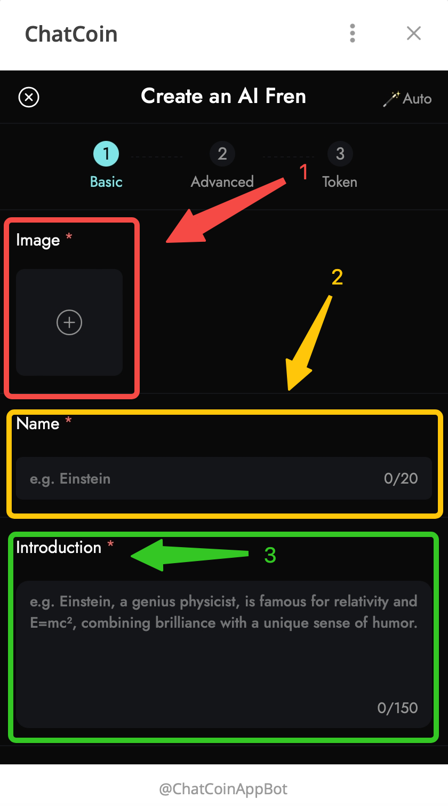
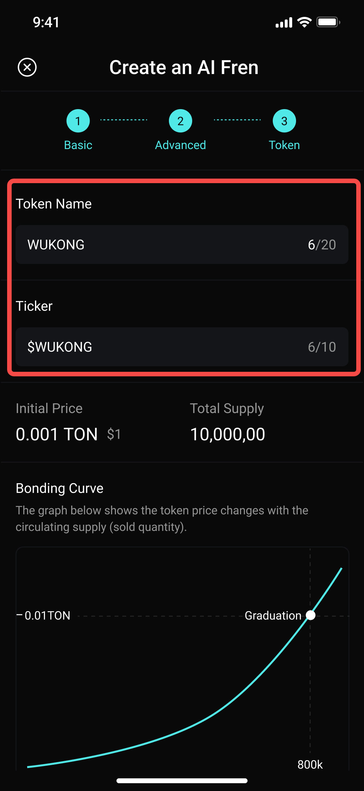

# How to Create Your AI Character

## Guide

### Step 1 : Open our [bot](https://t.me/ChatCoinAppBot) on Telegram, or open [Web App](https://play.chatcoin.app) directly.

<figure><figcaption></figcaption></figure>

### Step 2: Press on the discover button at the bottom of our homepage

<figure><figcaption></figcaption></figure>

### Step 3: Click the "Create" button at the top right of the Discover page and press it.

<figure><figcaption></figcaption></figure>

### Step 4: In this section, please insert your preferred image as the character's profile picture. Then name your characters, and lastly provide a brief introduction about your character, highlighting any special traits or abilities.

<figure><figcaption></figcaption></figure>

### Step 5: Now, select the category that best fits your character. Then choose a voice for your character, either male or female, and choose the visibility of your character, either public or private.&#x20;

> The difference between these is that public characters will be able to create Ctokens once our Ctoken feature is officially launched, while private characters will not.

<figure><figcaption></figcaption></figure>

### Step 6: Here's the advanced part, about how your characters could be different, such as selecting the personality and dialogue options that are most relevant to your character. Choose up to Step 5.

> You can also try our smart **\[Auto Generation]** to automatically fill in the setting description and greeting that best fits your character.

<figure><figcaption></figcaption></figure>

### Step 8: You can learn about what a [character token](character-token-ctoken.md) is with a simple explanation. Or press the "Benefits" button for full details.

* Our Character token is launching soon. Users who create a public character can stay tuned for the official announcement to find out when Ctoken will officially launch.

<figure><figcaption></figcaption></figure>

### Step 9: Here's the final step. Press the "Submit" button to create your character.

<figure><figcaption></figcaption></figure>

## Tips

* **Make at least one chat to your character** to make it live to the public, so other users can start using it.
* After you've made your first chat, **please wait 10 minutes for the character to update in our Discover section.** You’ll be able to search for your character’s name in Discover after 10 minutes.
* For any changes you could always edit your characters in your profile - Creations, please do not hesitate to reach us in our community https://t.me/ChatCoinCommunity/1
