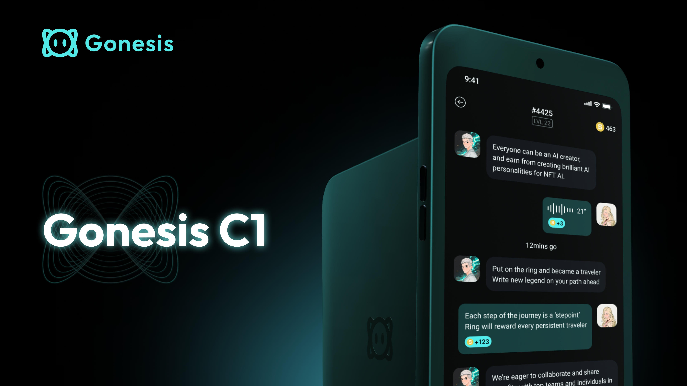
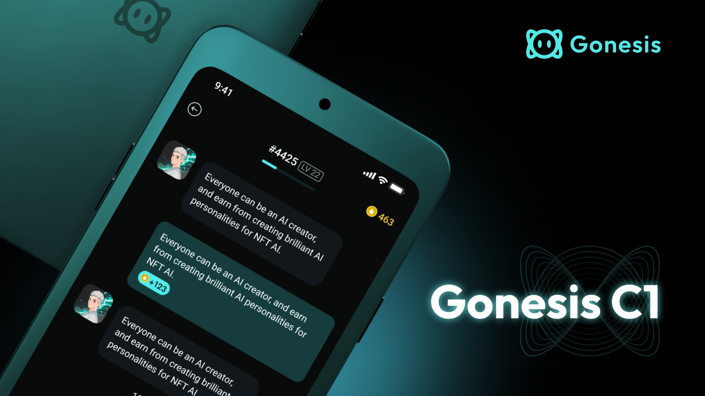

# Gonesis C1

**Gonesis C1** is the next generation AI device designed for consumer market. It's the first truly portable AI device, 𝗼𝗽𝗲𝗿𝗮𝘁𝗲𝗱 𝘀𝗶𝗺𝗽𝗹𝘆 𝗯𝘆 𝗳𝗶𝗻𝗴𝗲𝗿 𝘁𝗼𝘂𝗰𝗵. It enables your AI to interact with the physical world.

You can carry and show up your NFT everywhere. By pairing it with the Gonesis Chat, you can unlock countless applications for AI agents in the real world.

## What Can You Do With C1

* A crypto wallet and AI assistant in a secure environment.
* Discover nearby crypto assets holders in a easy way.
* Proof of assets ownership in real world.
* Proof of participation for IRL events.
* Build a geographical distribution map of NFT communities.
* Participate in various reward systems provided by other DePIN projects.
* A good wingman for socializing with strangers or anonymous socializing.
* Some simple social interactions, such as pairing, greeting, witnessing, liking, etc.
* More...

## Prototype

<figure><figcaption></figcaption></figure>

<figure><figcaption></figcaption></figure>

## Specifications

| Item          | Description                                                                   |
| ------------- | ----------------------------------------------------------------------------- |
| Processor     | MediaTe Helio P35                                                             |
| RAM           | 4GB                                                                           |
| Storage       | 128GB                                                                         |
| Display       | 4.3 inch OLED touchscreen                                                     |
| Motion Sensor | <ul><li>Accelerometer</li><li>Gyroscope</li></ul>                             |
| Location      | <ul><li>Magnetometer </li><li>GPS</li></ul>                                   |
| Connectivity  | <ul><li>Bluetooth 5.0</li><li>Wi-Fi with 2.4GHz+5GHz</li><li>4G LTE</li></ul> |
| Battery Life  | 2000mAh                                                                       |
| Charging      | Type-C                                                                        |

