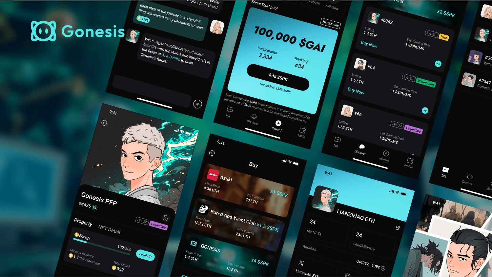

# Gonesis Chat

Gonesis Chat is an AI chat application powered by [AI721](../de-ai-agent/ai721.md) (AI-NFT) and DePIN, similar to ChatGPT, but with the added benefit of earning token.

All AI characters in Gonesis Chat are AI-NFTs that you can train, lend, or rent from others to meet everyday needs. Also, we will onboard existing NFT collections to turn into AI characters, enhancing them with more interactive features.

Gonesis Chat will be the first application built on [Gonesis Neuro Net](../gonesis-neuro-net/).

## Talk-to-Earn

The Talk-to-Earn feature allows you to earn rewards when you keep talking with your AI agent, such as training languages, asking AI for thoughts and suggestions, interacting with AI to pass time, and having AI assist you with some tasks, etc.

**The more you talk, the better it understands you, the more rewards you earn.**

We'll launch a token as rewards, used to unlock more fun, like different styles of pre-defined AI personalities, staking, buying decentralized computing and storages, and other resources from our partners.

We will implement all the core features on a mobile app, but if you own a Gonesis C1, you will be able to enjoy an enhanced experience.

## Product Demo

<figure><figcaption></figcaption></figure>

## Supported Platform

Both PC and Mobile (IOS\&Android).

## Play with Gonesis C1

You can access most of the Gonesis AI features and the whole Talk-to-Earn experience through the app.&#x20;

However, if you want to truly experience the charm of NFTs interacting with reality, you need one more device: **Gonesis C1**. With Gonesis C1, you'll unleash the infinite magic of NFTs in the real world.

Check more details about Gonesis C1:&#x20;


[gonesis-c1.md](gonesis-c1.md)


